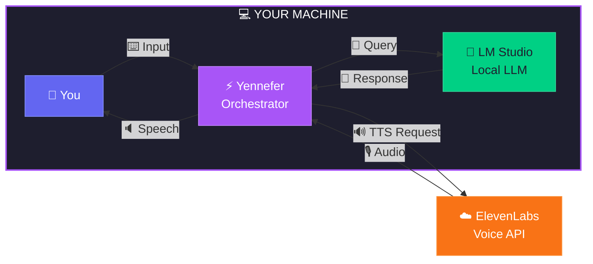

<!-- Animated Header -->


<div align="center">

<!-- Typing Animation -->
<a href="https://git.io/typing-svg"></a>

<br><br>

<!-- Fancy Badges -->
<a href="https://python.org"></a>
<a href="https://lmstudio.ai"></a>
<a href="https://elevenlabs.io"></a>

<a href="LICENSE"></a>

<br><br>

<!-- Quick Links with Icons -->
[](#-features)
[](#-quick-start)
[](#-recommended-models)
[](#%EF%B8%8F-voice-configuration)
[](#-roadmap)

</div>

<!-- Animated Divider -->


## 🎭 What Is This?

Yennefer is a conversational AI that runs **entirely on your machine** using [LM Studio](https://lmstudio.ai). She's not another sycophantic assistant—she has opinions, standards, and won't coddle you.

The only cloud touch is [ElevenLabs](https://elevenlabs.io) for premium neural TTS (optional—free tier gives you 10K chars/month).

<br>

### Why Local?

> 🔒 Your conversations **never leave your hardware**
> 
> 💰 No API rate limits or surprise bills
> 
> 🔄 Swap models anytime—Nemotron, Qwen, Llama, whatever
> 
> ✈️ Works offline (except voice synthesis)

### Why Yennefer?

> 🎯 Direct feedback, not corporate pleasantries
> 
> 🧠 Actually helpful, not just agreeable
> 
> 🎙️ Premium voice that doesn't sound like a robot
> 
> ⚡ Fast—runs on your GPU, not a queue

<!-- Animated Divider -->


## 🏗️ Architecture

<div align="center">



<br>

<table>
<tr>
<td align="center">
<br>
<sub>Text or Voice Input</sub>
</td>
<td align="center">
➡️
</td>
<td align="center">
<br>
<sub>Orchestrator</sub>
</td>
<td align="center">
➡️
</td>
<td align="center">
<br>
<sub>Local LLM</sub>
</td>
</tr>
</table>

<br>


<br>


<br>
<sub>🌐 Cloud TTS • Optional • Free Tier Available</sub>

</div>

<br>

<details>
<summary><b>📜 View Text Diagram</b></summary>
<br>

```
┌─────────────────────────────────────────────────────────────────────────┐
│                         💻  YOUR MACHINE                            │
│  ┌──────────┐    ┌─────────────────┐    ┌─────────────────────┐  │
│  │  👤 You   │───▶│  ⚡ Yennefer    │───▶│  🧠 LM Studio      │  │
│  │ keyboard │    │  orchestrator  │    │  local LLM engine  │  │
│  └──────────┘    └────────┬────────┘    └─────────────────────┘  │
│                        │                                          │
└────────────────────────┼────────────────────────────────────────────────┘
                         │
                         ▼
                ┌─────────────────┐
                │ ☁️ ElevenLabs  │  ← Only external call
                │   voice API    │
                └─────────────────┘
```

</details>

<!-- Animated Divider -->


## ✨ Features

<div align="center">

| | Feature | Description |
|:--:|:--------|:------------|
| 🧠 | **Local LLM** | Any GGUF model via LM Studio—Nemotron, Qwen, Llama, Mistral, DeepSeek |
| 🎙️ | **Premium Voice** | ElevenLabs neural TTS with custom voice cloning support |
| 🎭 | **Real Personality** | Sharp, confident, witty—inspired by Yennefer of Vengerberg |
| 📊 | **Token Tracking** | Visual context window with auto-trim at 85% capacity |
| 💳 | **Credits Monitor** | Real-time ElevenLabs character usage tracking |
| 🧹 | **Thinking Stripper** | Auto-removes `<think>` tags so reasoning isn't spoken aloud |
| 🖥️ | **Cross-Platform** | Windows native or Mac → Windows remote via LAN |

</div>

<!-- Animated Divider -->


## 🚀 Quick Start

### Prerequisites

<div align="center">

| Requirement | Why | Get It |
|:-----------:|:---:|:------:|
| <br>**Python 3.10+** | Runtime | [python.org](https://python.org) |
| <br>**LM Studio** | Local LLM | [lmstudio.ai](https://lmstudio.ai) |
| <br>**ElevenLabs** | Voice | [elevenlabs.io](https://elevenlabs.io) |
| <br>**NVIDIA GPU** | Speed | Recommended |

</div>

### Installation

```bash
# Clone the repo
git clone https://github.com/kunalnano/yennefer.git
cd yennefer

# Windows
.\setup.bat

# Mac/Linux
python3 -m venv .venv && source .venv/bin/activate
pip install -r requirements.txt
```

### Configuration

```bash
# Create your environment file
cp .env.example .env
```

Edit `.env` with your keys:
```env
ELEVENLABS_API_KEY=your_key_here      # From elevenlabs.io/settings/api-keys
ELEVENLABS_VOICE_ID=your_voice_id     # From your Voice Library
```

### Launch

<table>
<tr>
<td>

**1️⃣ Start LM Studio**
- Load a model
- Go to Local Server
- Click Start

</td>
<td>

**2️⃣ Run Yennefer**
```bash
# Windows
.\start_yennefer.bat

# Mac/Linux
./start_yennefer.sh
```

</td>
</tr>
</table>

**That's it. She's waiting.**

<!-- Animated Divider -->


## 🎮 Commands

<div align="center">

| Command | What It Does |
|:-------:|:-------------|
| `status` | 📊 Show token usage and context window health |
| `credits` | 💳 Display ElevenLabs character usage |
| `voice` | 🎙️ Show voice settings and session stats |
| `clear` | 🧹 Wipe conversation memory |
| `quit` | 👋 Exit gracefully |

</div>

> 💡 **Pro tip:** On Windows, press `Win+H` for system-level voice dictation.

<!-- Animated Divider -->


## 🤖 Recommended Models

<div align="center">

| Model | VRAM | Speed | Notes |
|:------|:----:|:-----:|:------|
| **NVIDIA Nemotron-Mini-4B** | ~4GB | ⚡⚡⚡ | Great for quick interactions |
| **Nemotron-3-Nano-30B-A3B** | ~18GB | ⚡⚡ | Best reasoning-to-VRAM ratio |
| **Qwen3-30B-A3B** | ~18GB | ⚡⚡ | Excellent all-around performer |
| **Llama-3.1-8B-Instruct** | ~6GB | ⚡⚡⚡ | Good for lighter hardware |
| **DeepSeek-R1-Distill-Qwen-14B** | ~10GB | ⚡⚡ | Strong reasoning model |

</div>

> 🧠 **Reasoning models** that use `<think>...</think>` tags are automatically filtered. Yennefer thinks before speaking, but keeps her thoughts to herself.

<!-- Animated Divider -->


## 🎙️ Voice Configuration

<div align="center">

| Model | Latency | Quality | Best For |
|:------|:-------:|:-------:|:---------|
| `eleven_turbo_v2_5` | ⚡ Fastest | Good | Daily use |
| `eleven_flash_v2_5` | Fast | Good | Balance |
| `eleven_multilingual_v2` | Slower | Best | Quality priority |

</div>

Fine-tune the voice in `config/jarvis.yaml`:

```yaml
voice_output:
  stability: 0.6          # 0-1: Higher = more consistent pitch
  similarity_boost: 0.75  # 0-1: Voice matching accuracy
  style: 0.0              # 0-1: Style exaggeration (keep low)
  speed: 1.15             # 0.25-4.0: Speech rate
```

<!-- Animated Divider -->


## 🌐 Remote Setup (Mac → Windows)

Running LM Studio on a beefy Windows rig but want to talk from your Mac?

```
┌─────────────────┐                    ┌─────────────────┐
│  🍎 Mac         │    LAN/WiFi        │  🪟 Windows     │
│  (thin client)  │◄──────────────────▶│  (GPU server)   │
│  Yennefer CLI   │                    │  LM Studio      │
└─────────────────┘                    └─────────────────┘
```

1. **Windows (LM Studio):** Enable "Serve on Local Network" in Local Server settings
2. **Windows:** Run `ipconfig` → note your LAN IP (e.g., `192.168.1.100`)
3. **Mac:** Update `config/jarvis.yaml`:
   ```yaml
   llm:
     api_base: "http://192.168.1.100:1234/v1"
   ```

<!-- Animated Divider -->


## 🎭 Personality

<div align="center">

*Yennefer doesn't do corporate AI pleasantries. She's helpful, but she'll call out bad ideas.*

</div>

<table>
<tr>
<td width="33%">

> **You:** I'm thinking of learning three programming languages at once.
>
> **Yennefer:** How ambitious. You'll drown in syntax before you master any of them. Pick one. Learn it properly. Then consider the others.

</td>
<td width="33%">

> **You:** Can you help me with my code?
>
> **Yennefer:** Show me what you've got. I'll tell you what's wrong with it.

</td>
<td width="33%">

> **You:** I want to build a startup but I have no idea what problem to solve.
>
> **Yennefer:** Then you don't want to build a startup—you want the *idea* of building one. Find a problem that genuinely irritates you first.

</td>
</tr>
</table>

<div align="center">

*She's an equal, not a servant. Inspired by Yennefer of Vengerberg—confident, sharp, doesn't suffer fools gladly.*

</div>

<!-- Animated Divider -->


## 🗂️ Project Structure

```
yennefer/
├── jarvis/                 # Core Python package
│   ├── main.py             # Entry point + ASCII banner
│   ├── orchestrator.py     # Conversation loop controller
│   ├── brain.py            # LLM integration (OpenAI-compatible API)
│   ├── voice.py            # ElevenLabs TTS + thinking tag stripper
│   ├── ears.py             # Input handler
│   └── config.py           # YAML loader with ${ENV_VAR} expansion
├── config/
│   └── jarvis.yaml         # Main configuration file
├── .env.example            # API key template
├── requirements.txt        # Python dependencies
├── start_yennefer.bat      # Windows launcher
├── start_yennefer.sh       # Mac/Linux launcher
├── CHANGELOG.md            # Version history
└── README.md               # You are here
```

<!-- Animated Divider -->


## 🐛 Troubleshooting

<details>
<summary><b>🔴 "Cannot connect to LM Studio"</b></summary>
<br>

- Is LM Studio running with a model loaded?
- Check Local Server tab shows "Running"
- Verify `api_base` in config matches your setup (default: `http://localhost:1234/v1`)

</details>

<details>
<summary><b>🔴 "ElevenLabs 401 error"</b></summary>
<br>

- Verify API key in `.env` file
- Check key validity at https://elevenlabs.io/app/settings/api-keys
- Ensure you haven't exceeded your character limit

</details>

<details>
<summary><b>🔴 Voice sounds robotic or jarring</b></summary>
<br>

- Increase `stability` to 0.7-0.8 in config
- Try `eleven_multilingual_v2` model for smoother output
- Reduce `speed` if words are clipping

</details>

<details>
<summary><b>🔴 Thinking tags being spoken aloud</b></summary>
<br>

- Update to v0.3.0+ (automatic stripping included)
- The stripper handles `<think>`, `<thinking>`, unclosed tags, and edge cases

</details>

<!-- Animated Divider -->


## 📋 Roadmap

<div align="center">

### 🔜 Coming Soon

| Feature | Status |
|:--------|:------:|
| Wake word detection — "Hey Yennefer" | 🔲 |
| Streaming TTS — speak before generation completes | 🔲 |
| Interrupt handling — stop mid-sentence | 🔲 |

### 🔮 Future

| Feature | Status |
|:--------|:------:|
| Memory persistence across sessions | 🔲 |
| Multi-voice support — switch characters | 🔲 |
| Tool plugins — file ops, web search, etc. | 🔲 |

</div>

<!-- Animated Divider -->


## 📜 License

<div align="center">

MIT — Do whatever you want. Credit appreciated but not required.

</div>

## 🤝 Contributing

PRs welcome. See [CHANGELOG.md](CHANGELOG.md) for what's been done.

<div align="center">

| Good First Contributions |
|:------------------------|
| 🎤 Wake word detection integration (Porcupine, Snowboy, etc.) |
| 🔊 Alternative TTS backends (Coqui, Bark, local options) |
| 🎙️ Voice activity detection for natural turn-taking |
| 🔢 Tiktoken integration for accurate token counting |

</div>

<!-- Animated Divider -->


<div align="center">

<br>

### Built with spite and good taste.

<br>


<br>

**If you find this useful, star the repo.**

*Yennefer doesn't ask for validation, but the algorithm appreciates it.*

<br>


</div>
